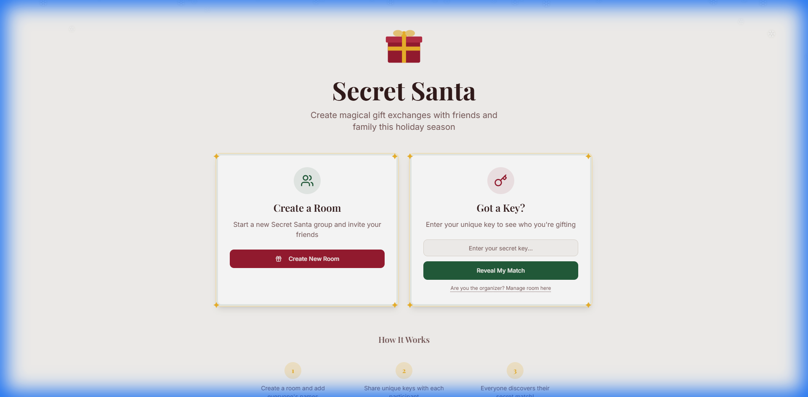
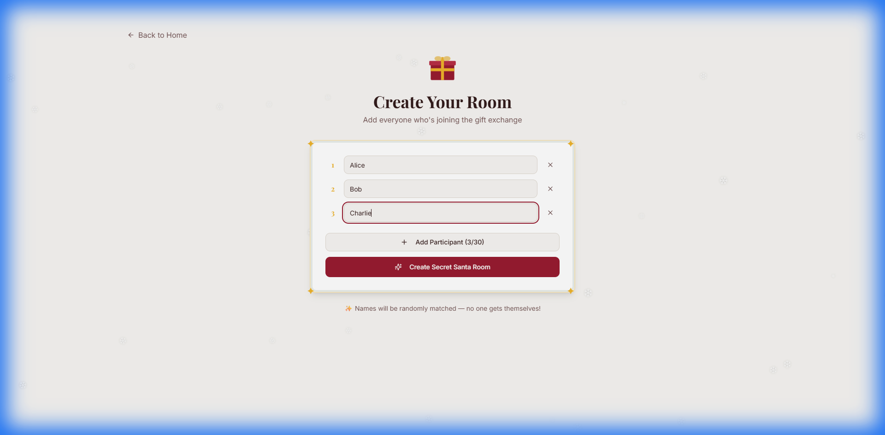
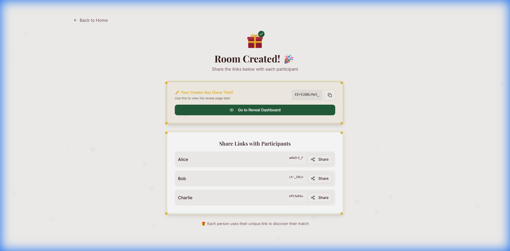

# Creator Workflow

Follow these simple steps to set up your Secret Santa group.

## Step 1: Start at the Home Page

Visit the home page and look for the "Create Secret Santa Room" card.

## Step 2: Add Participants

Enter the names of everyone joining the exchange. You can add as many as you need!

## Step 3: Create & Share

Click **Create** and you'll get a unique dashboard with links for every person.

Use the **Share** button next to each name to send their personalized link directly via WhatsApp, Telegram, or copy it to your clipboard.
