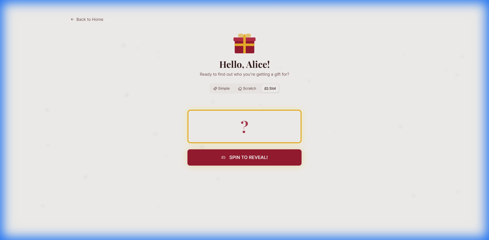
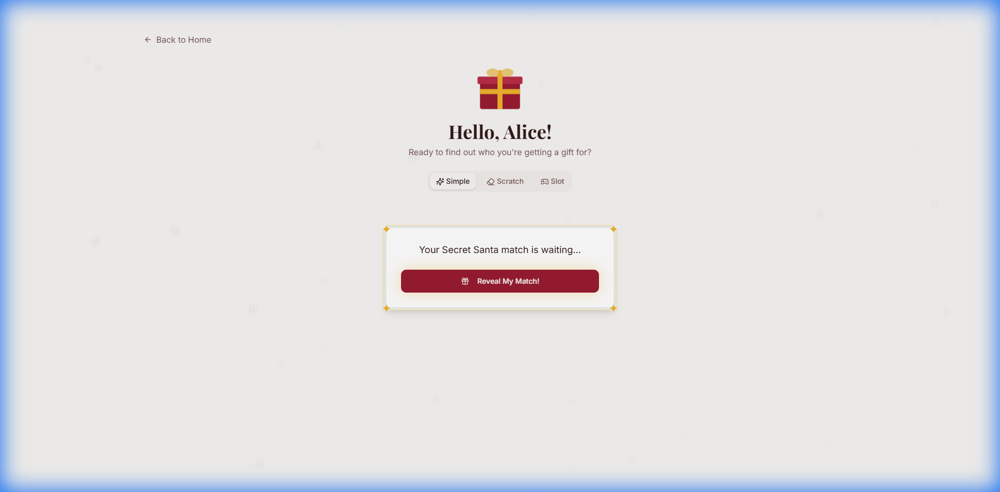
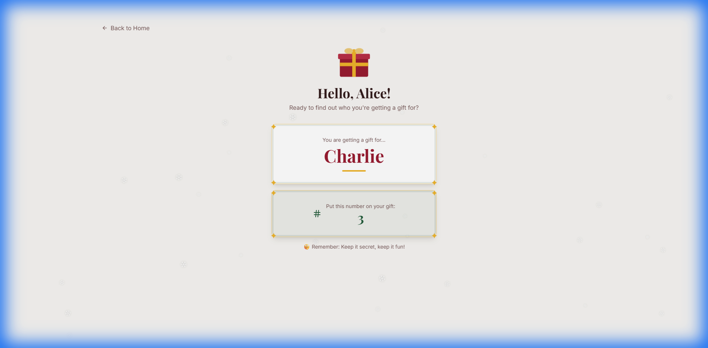

# Participant Workflow

So you've received a link... what now?

## Step 1: Open Your Link

Click the link you received. You'll see a personalized greeting confirming it's really you!

## Step 2: Choose Your Vibe

You don't just "get" a name—you allow fate to reveal it! Choose from **Simple**, **Scratch**, or **Slot** modes.

*(Pictured: Simple Mode selected)*

## Step 3: The Reveal!

Click, scratch, or spin to find out who your match is. Don't forget the secret number!

Make sure to note down your match and the unique **Gift Number** to tag on your present.
